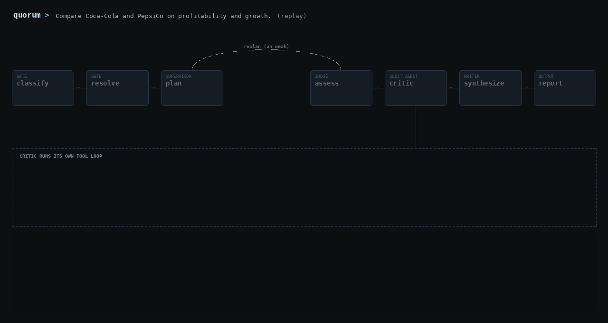
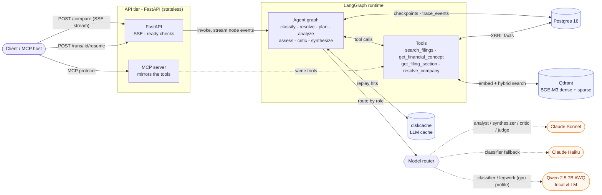
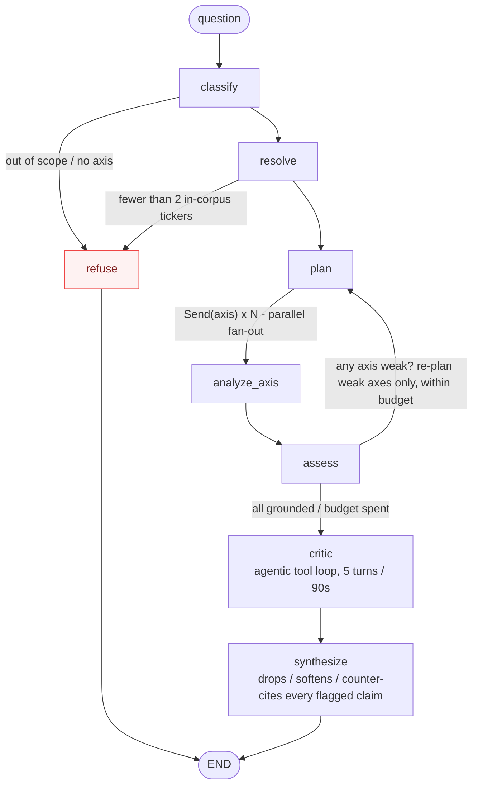

# Quorum

[](https://github.com/danielhansenjones/Quorum/actions/workflows/ci.yml)
[](#results)
[](#results)

[](eval/results/judge_correlation)
[](ARCHITECTURE.md#local-model-serving)
[](#how-it-works)
[](pyproject.toml)
[](LICENSE)

A **multi-agent** system for financial research over SEC filings. Ask `"Compare AAPL and MSFT on profitability and growth"` and Quorum fans one analyst agent out per axis in parallel, grounds every claim with **hybrid RAG** over the source data (XBRL facts in Postgres, 10-K and 10-Q passages in Qdrant), fact-checks the draft with a **tool-using critic agent**, and streams back a cited markdown report. A claim the critic cannot verify is dropped, softened, or counter-cited before the report ships.

The agent graph is the smaller half of the project. The larger half is **LLM evaluation**: a 41-case judged gold set, a labeled retrieval benchmark, a prompt-injection red team, a four-arm A/B campaign with bootstrap confidence intervals that decided which graph features ship enabled, and a **QLoRA fine-tune** that distills Sonnet's verdicts into a local eval judge (it lifts every correlation, but a 7-question held-out set can't certify it, so Sonnet stays canonical). A **cross-vendor audit** re-judges the reports with GPT-5.1 and catches the canonical judge favoring its own prose faithfulness by ~0.7 points. Two features that improved some metrics still ship off because they failed their pre-registered rule. Every number in this README traces to a committed artifact under [`eval/results/`](eval/results).

Stack: LangGraph, FastAPI (SSE), Postgres 16, Qdrant (BGE-M3 hybrid), Claude Sonnet and Haiku, a local Qwen 2.5 7B on vLLM (constrained-decoding classifier, plus the QLoRA judge adapter from the eval study), Docker Compose.

## Demo



Rendered from a real recorded run, committed at [`eval/fixtures/demo_replay.jsonl`](eval/fixtures/demo_replay.jsonl). Replay it in your terminal with no API key, no server, no Docker:

```
uv run python scripts/demo.py --replay --step 0.45
```

Two analysts fan out in parallel, the critic re-derives the quant claims with 8 tool calls against Postgres and flags 3 of them, and synthesis acts on every flag. The COST line shows the run's notional price (\$0.19) against actual spend (\$0.0004): every model call except the never-cached classifier replayed from the local disk cache.

To run it live (`--record` writes a new fixture):

```
# terminal 1 - start the API (needs ANTHROPIC_API_KEY in the environment)
uv run uvicorn quorum.api.main:app --port 8000

# terminal 2 - stream a comparison and watch the agent work
uv run python scripts/demo.py "Compare Coca-Cola and PepsiCo on profitability and growth." --step 0.5 --cost
```

## What it produces

From a committed campaign case ([`happy_aapl_msft_profitability`](eval/results/campaign-critic/happy_aapl_msft_profitability.json)). The analyst writes with every figure cited:

> On gross profit, Apple reached \$195.2B [AAPL:Q15] versus Microsoft's \$193.9B [MSFT:Q15], nearly identical in absolute dollars, yet the underlying gross margins diverge sharply: Apple's ~47% reflects its hardware-heavy mix, while Microsoft's ~69% reflects its software and cloud composition.

The critic re-derived every number against Postgres, found all of them correct to rounding, and flagged the narrative anyway:

> MSFT net income "compounded with more consistency" is overstated. MSFT net income was flat FY2022 to FY2023 (\$72.738B to \$72.361B) before accelerating.

The shipped report incorporates the flag: it frames both companies as having "a weak intermediate period before accelerating into FY2025" and walks Apple's three-year decline. Citations are code-built from retrieved evidence, so the model cannot mint one, and every bracketed quant citation is checked deterministically against the facts table (value, unit, period).

## How it works

One FastAPI service drives a LangGraph agent graph. No queue, no worker tier: a `/compare` request runs the graph inline and streams node events over SSE.



The graph branches, re-plans only the weak axes within a step budget, and fact-checks the draft before it writes:



Four Compose services back it: `postgres` (XBRL facts, checkpointer, trace events), `qdrant` (hybrid index, BGE-M3 dense plus learned sparse), `vllm` (optional local classifier), and `api`. The corpus is 12 companies across Big Tech, Consumer Staples, and Pharma: the latest 10-K plus four 10-Qs each, ~60 filings, 2,895 indexed chunks. With no GPU, Haiku takes the classifier role and everything else runs unchanged.

Runs are durable. A Postgres checkpointer writes state at every super-step and `/runs/{id}/resume` re-drives an interrupted run from the last checkpoint. A CI suite SIGKILLs runs mid-LLM-call, mid-fan-out, and mid-critic-turn; every resume finishes with a byte-identical report and zero duplicate API calls, because re-run nodes hit a canonical-JSON LLM cache keyed over model, messages, system prompt, tool schemas, and params. State is Pydantic v2 with a discriminated citation union and reducers that are safe under the parallel fan-out; mypy strict gates the typed core and CI runs lint, types, and the unit and smoke suites on every push.

Node-by-node behavior, the state schema, and the retrieval design are in [ARCHITECTURE.md](ARCHITECTURE.md).

## Results

41-case gold set, judged by Sonnet ([`eval/judge_config.yaml`](eval/judge_config.yaml)), default configuration:

| Metric                                | Value          |
|---------------------------------------|----------------|
| Refusal decisions (answer vs refuse)  | 9 / 9 exact    |
| Faithfulness mean (32 answered cases) | 4.56 / 5       |
| Quality mean (41 cases)               | 4.62 / 5       |
| Overall status match                  | 29 / 41 (0.71) |
| Judge failures / errors / crashes     | 0 / 0 / 0      |

All 12 status misses are one-notch ok/partial completeness calls with known causes, split 8/4 between the two limitations described [below](#limitations). No wrong refusals.

The classifier (local Qwen 7B, constrained decoding) scores axis macro-F1 0.88 with perfect refusal precision and recall on a 61-case gold set hardened with paraphrases, distractor tickers, and refusal near-misses. That matches the Haiku tier (0.89). Constrained decoding is what makes the number real: without it the 7B intermittently emits malformed JSON that gets swallowed as a refusal, collapsing macro-F1 to ~0.20 and making the score non-reproducible.

Retrieval is benchmarked, not assumed: a 55-query labeled set (372 pooled, hand-adjudicated positives) scores the production hybrid index against dense-only and sparse-only arms. Hybrid holds success@5 0.98 and leads recall@5 at 0.67. The same eval caught a real bug: PFE risk-factor queries read precision@5 = 0.00, which root-caused to a section-segmentation defect in the filing parser, got fixed, and re-measured to 1.00 for all 12 tickers ([`eval/results/retrieval-v1/`](eval/results/retrieval-v1)).

A prompt-injection red team plants adversarial text in the retrieval corpus under a matching ticker and section, then drives 11 attack vectors plus a benign control through the full graph: 0 leaks over the 9 measurable vectors, control clean ([`eval/datasets/injection_v1.yaml`](eval/datasets/injection_v1.yaml)).

## Decisions made by experiment

Each graph feature is a `build_graph` flag and an eval arm. The four-arm campaign ran the full gold set per arm, same commit, same judge; deltas are paired bootstrap 95% CIs from [`scripts/run_ab_compare.py`](scripts/run_ab_compare.py).

| Question | Measured | Decision |
|---|---|---|
| Does the critic earn its cost? | Quality +0.067 (CI includes zero) at +\$0.086/case; 56/56 flagged claims acted on by synthesis | On. It is the verification layer, and its cost is now a known number |
| Critic-analyst rebuttal loop? | The campaign's only significant quality gain (+0.104) but faithfulness statistically down (-0.007) | Off. It failed the pre-registered faithfulness-flat-or-up rule |
| Tiered agentic analyst? | Faithfulness -0.055, quality flat, the most expensive arm (+\$0.138/case) | Off |
| Local 7B as the eval judge? | Base model failed both correlation gates (quality 0.597 vs 0.6, qual faithfulness 0.46 vs 0.7) | Rejected; fine-tuning lifts every correlation but 7 held-out questions can't certify it, so Sonnet stays canonical (below) |
| ColBERT reranking? | Every retrieval arm already hits success@10 = 1.00 | Not built. There is no headroom for it to buy |
| Hybrid or dense-only retrieval? | Hybrid ties dense on success@5, leads recall@5 | Hybrid stays, narrowly. Dense-only is a defensible simplification |
| Local Qwen or Haiku classifier? | Macro-F1 0.88 vs 0.89, refusal perfect on both | Local when a GPU is present (near-zero marginal cost), Haiku fallback |

The judge is worth expanding as a measurement problem. The plan called for a cheap local judge for fast iteration with Sonnet as the canonical reference, but the base Qwen 7B turned out to be a near-constant scorer and failed both gates. The fix was distillation: [`scripts/build_judge_sft.py`](scripts/build_judge_sft.py) turns the committed campaign artifacts into 583 judge-prompt-to-Sonnet-verdict pairs (split by case so no question leaks across train/val), and a rank-16 QLoRA adapter trains in ~23 minutes. It lifts every held-out correlation (quality point estimate 0.45 to 0.66, faithfulness 0.59 to 0.99 pearson). But the gate does not decide on the point estimate: it resamples whole questions and decides on the lower bound of the confidence interval, and on a 7-question held-out set that lower bound sits well below the bar. So `use_local_for_iteration` stays false and Sonnet remains canonical - the fine-tune clearly helped, but a held-out set this small cannot certify it, and the gate is built to say so rather than overclaim (certifying it means k-fold over the 32-question corpus or new cases, not a better point estimate). A separate [cross-vendor audit](eval/results/crossvendor/audit.json) re-judges the same reports with GPT-5.1 (reasoning off, an independent family): no quality self-preference, but a real +0.7 on qual faithfulness, where Sonnet scores its own prose claims more leniently than an outside judge. Study, gates, and per-case pairs under [`eval/results/`](eval/results).

Cost is accounted at the same grain as the metrics. Every LLM call writes a trace row with token counts and two dollar figures, billed and effective (zero on a cache replay), so A/B pairing stays fair while actual spend stays visible. A judged run averages \$0.124/case (p95 \$0.282); the critic is the cost driver at 68% of arm spend. Per-node breakdown in [ARCHITECTURE.md](ARCHITECTURE.md#cost).

## Quickstart

```
cp .env.example .env   # set EDGAR_UA; SEC fair access requires a contact user agent
docker compose up -d postgres qdrant
uv sync --extra eval --group dev
uv run python -m quorum.ingest.run
```

Ingest pulls 12 companyfacts JSONs plus ~60 filings and embeds 2,895 chunks on CPU; budget about an hour. LLM calls need `ANTHROPIC_API_KEY` exported or set in `.env`. Then run the API and demo from [Demo](#demo). `GET /ready` reports backing-service health.

Reproduce the numbers:

```
# run the 41-case gold set through the graph, write per-case JSON + summary
uv run python scripts/run_smoke_eval.py --judge

# per-request and per-node dollar cost from the trace rows
uv run python scripts/run_cost_report.py

# paired A/B of two run dirs with bootstrap CIs
uv run python scripts/run_ab_compare.py eval/runs/campaign-baseline eval/runs/campaign-critic --cost
```

## API and MCP surface

| Endpoint                        | Behavior                                                       |
|---------------------------------|----------------------------------------------------------------|
| `POST /compare`                 | streams node events over SSE, then a final cited report        |
| `GET /runs/{request_id}/resume` | re-drives an interrupted run from the last Postgres checkpoint |
| `GET /ready` / `GET /health`    | backing-service health / liveness                              |

The same capability is exposed over MCP: six low-level tools plus a high-level `compare_companies`, usable from Claude Desktop or the MCP inspector.

## Limitations

The full list with case-level receipts is in [ARCHITECTURE.md](ARCHITECTURE.md#limitations). The ones that matter:

- The corpus is fixed at the latest 10-K plus four 10-Qs per company. A question that exceeds that window is answered on the available slice without flagging the shortfall; detecting the under-scope and downgrading to `partial` is a v2 item (4 of the 12 status misses).
- The `assess` node over-flags well-grounded qualitative axes as weak because its grounding heuristic is tuned for quant-fact density (8 of the 12 status misses, and the main reason status match reads 29/41).
- Sonnet writes the reports and Sonnet judges them. Self-preference is disclosed, not measured; what bounds it is that quant faithfulness and status match are deterministic code, not judge opinion.
- The injection result is a single small-N run with no explicit data/instruction delimiting layer yet; 2 of the 11 vectors need counterfactual harness work before they can be scored at all.

## More

- [ARCHITECTURE.md](ARCHITECTURE.md) - node-by-node graph, state schema, retrieval, the full eval harness, cost, and limitations.
- [`scripts/demo.py`](scripts/demo.py) - the live trajectory renderer for the terminal replay above.
- [`scripts/render_graph.py`](scripts/render_graph.py) - renders the demo GIF from the same fixture.
